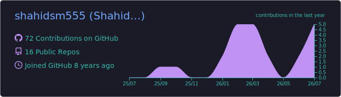
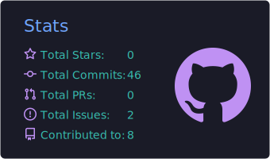
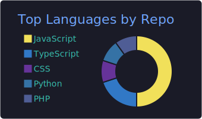
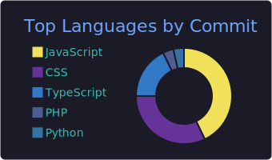
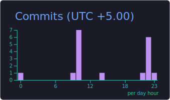

# Hi, I'm Shahid Manzoor 

I'm a software engineer with over 15 years of experience building scalable, interactive applications and enterprise-grade systems. Currently I'm a Senior Software Engineer at Bluell AB, where I focus on delivering reliable solutions in application deployment and scalability.

My day-to-day stack is React, Angular, Node.js, .NET Core, and PostgreSQL, with Azure DevOps handling the pipeline side. Lately much of my work involves integrating AI into real products — OpenAI APIs, Azure AI Foundry, and speech-to-text platforms like Deepgram and Sonix.

Happy to talk about full-stack development, application scalability, or getting AI features into production. You can reach me at shahidsm555@gmail.com.

## 🛠️ Tech Stack

## 📊 GitHub Stats

## 🤝 Connect With Me

---

